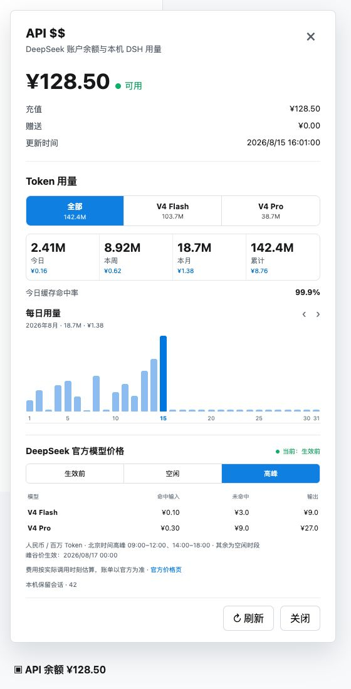
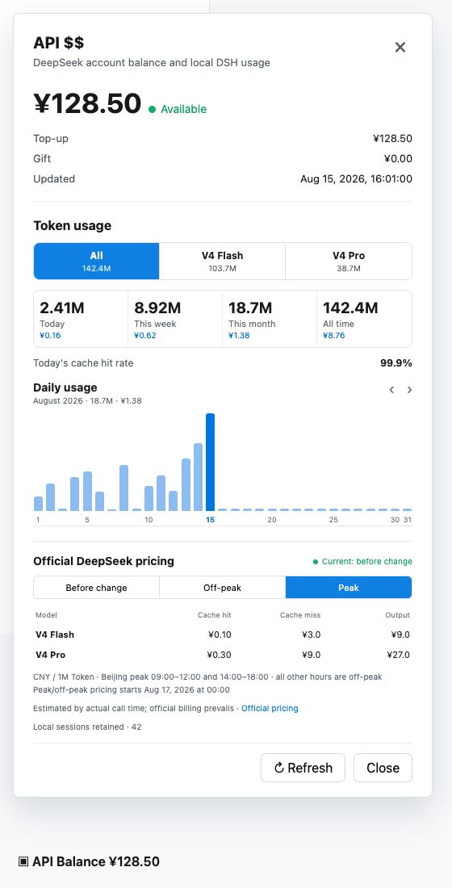
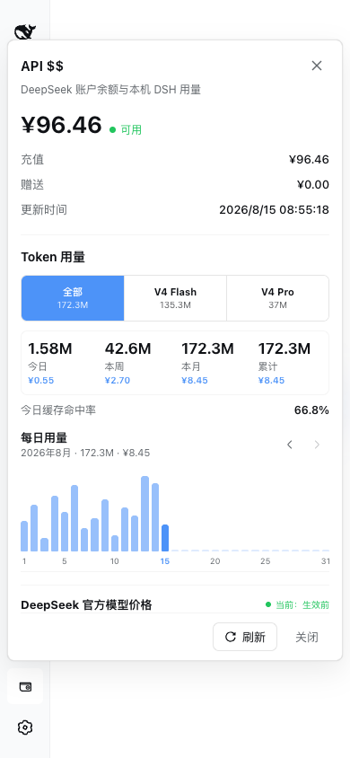

<h1 align="center">API $$</h1>

<p align="center"><strong>Your DeepSeek API balance, always visible in the DSH sidebar.</strong></p>

<p align="center">No dashboard switching. No API key in the browser. One click to see how much runway remains.</p>

<p align="center">
  <a href="README.md">简体中文</a> ·
  <strong>English</strong> ·
  <a href="https://github.com/ArcanePivot/dsh-api-balance/releases/tag/v0.2.0">v0.2.0</a> ·
  <a href="#quick-install">Quick install</a> ·
  <a href="INSTALL.en.md">Full install guide</a> ·
  <a href="SECURITY.md">Security</a> ·
  <a href="CHANGELOG.md">Changelog</a>
</p>

<p align="center">
  <a href="https://github.com/ArcanePivot/dsh-api-balance/actions/workflows/verify.yml"></a>
  <a href="https://github.com/ArcanePivot/dsh-api-balance/releases/tag/v0.2.0"></a>
  
  
  <a href="LICENSE"></a>
</p>

> [!IMPORTANT]
> `v0.2.0` supports **`@deepseek-ai/dsh@0.1.0-rc.6` only**. This is an unofficial, version-locked patch package, not a native Cordis plugin. The installers refuse any other DSH version or unrecognized target file.

## See it work

| Simplified Chinese | English |
| --- | --- |
|  |  |

<details>
<summary>View the 390 px mobile layout</summary>

<p align="center">
  
</p>

</details>

The screenshots come from a live DSH Web UI. Balance values, timestamps, workspace names, and session details have been replaced or removed.

## Why install it

| Balance at a glance | Host-only API key | Reversible install |
| --- | --- | --- |
| The sidebar keeps the current balance visible; click it for account status, currency, topped-up balance, and granted balance. | The browser calls a same-origin DSH route. The API key never enters the browser request and is never returned to the client. | The first install stores checksummed official files. Failed installs and uninstalls roll back. |

- `API 余额` in Simplified Chinese and `API Balance` in English
- Warning color below `20 CNY`
- Manual refresh, outside-click close, and `Esc` close
- Fallback for HTTP and older Safari environments without `crypto.randomUUID()`
- Windows and macOS install, uninstall, and restart helpers

## Quick install

### 1. Prepare DSH and the API key

The patch locates an **npm global installation** of the exact supported version. It cannot patch a temporary DSH copy launched only through `npx`.

```sh
npm install -g @deepseek-ai/dsh@0.1.0-rc.6
```

After starting DSH, save the API key in the DeepSeek card under `Settings -> Models`, or expose `DEEPSEEK_API_KEY` to the DSH process environment.

### 2. Get the project

```sh
git clone --branch v0.2.0 --depth 1 https://github.com/ArcanePivot/dsh-api-balance.git
cd dsh-api-balance
```

You can also download the source archive from the [`v0.2.0` release page](https://github.com/ArcanePivot/dsh-api-balance/releases/tag/v0.2.0) and run the following commands from the extracted directory. Pinning the version avoids installing unreleased changes from a future `main` branch.

### 3A. Windows

```powershell
.\install.ps1 -WhatIf  # Validate version, files, and backups without changing anything
.\install.ps1          # Back up official files, install, and verify SHA-256
.\relaunch-dsh-web.ps1 # Restart a manual DSH process on the default 127.0.0.1:3080
```

For a Task Scheduler deployment, restart the original task so its environment, permission mode, and hidden-window behavior remain intact:

```powershell
.\relaunch-dsh-web.ps1 -TaskName "<your DSH task name>"
```

### 3B. macOS

```bash
./install.sh --dry-run  # Validate without changing anything
./install.sh            # Back up official files, install, and verify SHA-256
./relaunch-dsh-web.sh   # Restart a manual DSH process on the default 127.0.0.1:3080
```

For a launchd deployment, restart the original service:

```bash
./relaunch-dsh-web.sh --launchd-label "<your launchd label>"
```

Refresh the browser once after installation. You do not need to clear site data or conversation history. Custom ports, PowerShell execution policy, uninstall, upgrades, and common failures are covered in the [full install guide](INSTALL.en.md).

## How it works

```text
Browser                              DSH host
POST /api/llm.balance  ---------->  Resolve DEEPSEEK_API_KEY
No API key in request                GET {baseURL}/user/balance
                       <----------  Return normalized balance fields
```

The host reads `baseURL`, `apiKeyEnv`, and the API key from the `llm-deepseek` settings and DSH credentials service. If a custom `baseURL` is configured, the host sends the key to that endpoint, matching the DeepSeek adapter behavior. Use only endpoints you trust.

Balance data is account information. Anyone who can access the DSH Web UI can view the balance after installation, although they cannot view the API key. Keep the existing DSH access controls in place and read the [security notes](SECURITY.md).

## Compatibility

| Item | Supported range |
| --- | --- |
| DSH | `0.1.0-rc.6` only |
| Windows | Windows 10 / 11; Windows PowerShell 5.1 or PowerShell 7 |
| macOS | Apple Bash 3.2 or newer; Node.js and npm required |
| UI languages | Simplified Chinese and English |
| Live Windows verification | Windows 10, Node 24, DSH `0.1.0-rc.6` |
| macOS lifecycle verification | macOS Bash 3.2, Node 22, isolated official rc.6 npm files |

> The macOS installer has passed install, idempotent reinstall, uninstall, idempotent re-uninstall, and tamper-rejection tests in an isolated fixture. Run `--dry-run` before a live install; use `-WhatIf` on Windows.

## Uninstall and upgrade

Windows:

```powershell
.\uninstall.ps1 -WhatIf
.\uninstall.ps1
```

macOS:

```bash
./uninstall.sh --dry-run
./uninstall.sh
```

Always uninstall this patch and restore the official files before upgrading DSH. Do not reapply an old patch to a new DSH release; wait for a matching project release.

## Verification

CI and the local verifier:

- Fetch the official `0.1.0-rc.6` packages from npm
- Verify that both minimal patches apply cleanly
- Compare the patched official files byte-for-byte with `files/`
- Exercise macOS install, idempotency, uninstall, rollback, and tamper guards
- Parse Bash, PowerShell, and JavaScript and scan for common secrets and personal paths

```bash
./scripts/verify-patches.sh
```

## Documentation

| Document | Purpose |
| --- | --- |
| [Full install guide](INSTALL.en.md) | Download, install, restart, verify, uninstall, upgrade, and troubleshooting |
| [Security](SECURITY.md) | API key and balance data flow, trusted endpoints, and vulnerability reporting |
| [Changelog](CHANGELOG.md) | Release status and version changes |
| [Third-party notices](THIRD_PARTY_NOTICES.md) | Origin and license of modified DeepSeek Harness artifacts |
| [Contributing](CONTRIBUTING.md) | Bug reports, proposed changes, and privacy precautions |

## Project boundary

The installer replaces only two compiled files: the host balance route and the client sidebar. DSH already provides `sidebar.footer.action` and private Client-to-Host calls. A future release is intended to move to those official extension points and stop replacing compiled core files.

`API $$` is the display brand. The repository, installation directory, and code identifiers remain `dsh-api-balance` because `$` has special meaning in command shells.

## License

New project code is available under the [MIT License](LICENSE). Modified DeepSeek Harness artifacts retain their original MIT license and copyright; see [Third-party notices](THIRD_PARTY_NOTICES.md).
